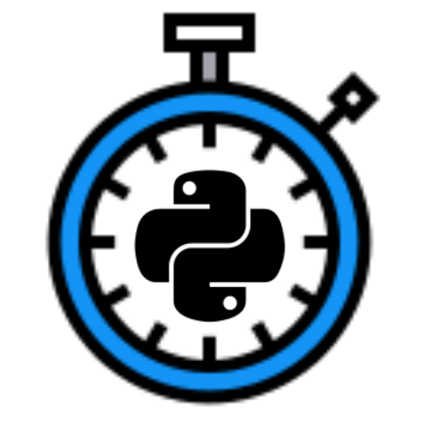
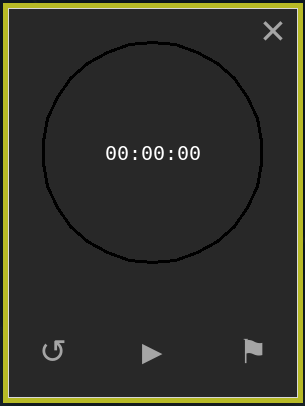
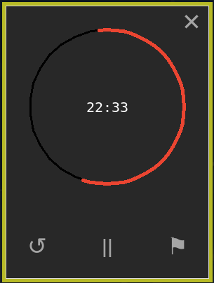
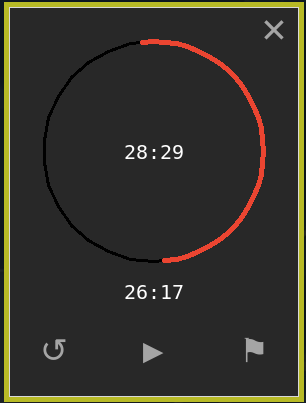

# python stop-watch

<p align="center">
  
</p>

It a simple stopwatch application made with tkinter and turtle
it doesn't look pretty but it work fine enough to use

I'm always in need of a stopwatch when I run some tests, and I tought it would be funnier to make one myself

### how it look so far :





#### there is also a "flag" button to save a time



### todo list:
```
_add the timer function
_add a theme selector
```

