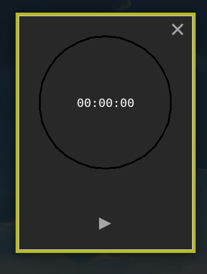
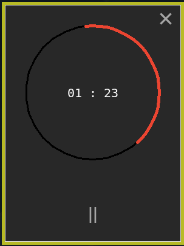

# python stop-watch

## todo list:
```
_better color when hovering on button ? 
_better circle behind the circle (you know what that mean) 
_reset button ↻
_flag button
_maybe better time calculation

if really i'm not lazy:
_add the timer function
_add a theme selector
```

### edit : it start to look good :




